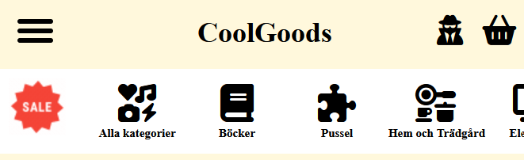
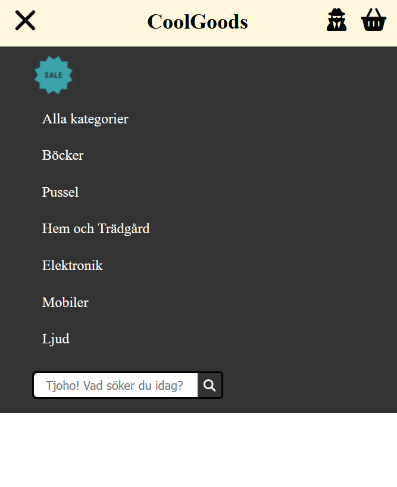
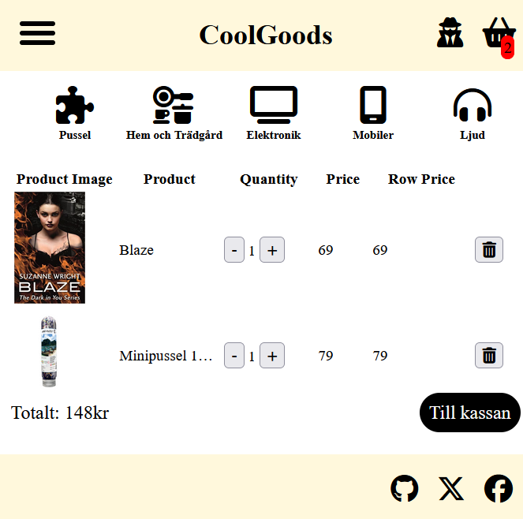

# 🛍️ CoolGoods – En Webbshop i PHP

CoolGoods är en webbshop jag har utvecklat med **PHP** som backend och **MySQL** för databashantering. Projektet erbjuder användare möjligheten att registrera sig, logga in, söka produkter, lägga varor i kundvagnen och genomföra köp via en integrerad betalningslösning med **Stripe**. En extern sökmotor har också integrerats för att förbättra produktsökningen, och sidan har en **responsiv design** som fungerar bra på både dator, surfplatta och mobil.

Fokus har legat på **funktionalitet**, **säkerhet** och **användarvänlig design**. Webbshopen är uppdelad i flera komponenter som hanterar allt från användarflöden till betalning och produkthantering.

---

## 🧰 Teknik

- 🐘 **Backend**: PHP (procedurbaserat)
- 🗄️ **Databas**: MySQL
- 🎨 **Frontend**: HTML, CSS, JavaScript
- 💳 **Betalning**: Stripe API
- 🔍 **Sökfunktion**: Integration med extern sökmotor
- 🧠 **Sessionshantering**: PHP Sessions
- 📱 **Responsivitet**: CSS Media Queries
- 🧾 **Versionhantering**: Git

---

## ✨ Funktioner

- 👤 Användarregistrering och inloggning _(pågår – ännu ej färdigställt)_
- 📦 Produktkatalog med sökfunktion
- 🏷️ Kategorisering av produkter
- 🎞️ Horisontell slider för produktkategorier
- 🛒 Kundvagn med dynamisk uppdatering _(pågår – ännu ej färdigställt)_
- 💰 Checkout med betalning via Stripe
- 🔐 Säker sessionshantering för användare och kundvagn
- 📱 Mobilvänlig och responsiv design

---

## 🐛 Utmaningar

- 📐 Menyer och dropdowns som inte fungerade korrekt på olika skärmstorlekar.
- 🧮 Hantering av sessionsdata för både kundvagn och inloggning.
- 🎨 Att strukturera CSS för att få layouten att se konsekvent ut i olika webbläsare.
- 🔄 Att koppla ihop backend (PHP) med frontend (HTML/CSS/JavaScript) på ett smidigt sätt.
- 🎢 Implementering av en horisontell slider för produktkategorier som skulle fungera med både mus och touch på olika enheter.

---

## 📚 Lärdomar

Trots de tekniska utmaningarna har jag lärt mig mycket om fullstack-webbutveckling – allt från databashantering och API-integration till frontend-design och UX. Projektet har gett mig en praktisk förståelse för hur man bygger och strukturerar en komplett webbapplikation.

---

## 🖼️ Skärmbilder

>   
> 
> 

---
